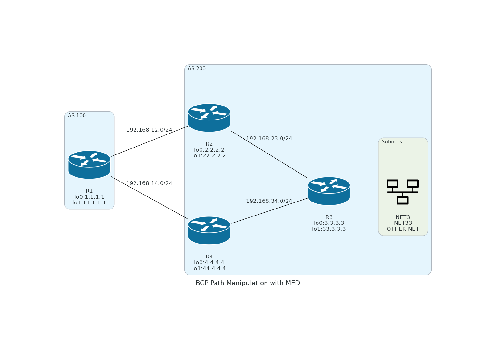

## Topologia



# Tarefa 1: Configurar Sessões eBGP

## Objetivo
Configurar o BGP básico para estabelecer conectividade entre os ASs. O AS 200 (R2, R3, R4) deve formar um *full-mesh* interno (OSPF já foi configurado como IGP), enquanto R2 e R4 estabelecem sessões eBGP com R1 (AS 100). Os roteadores devem anunciar suas interfaces **Loopback0** no BGP.

## Instruções
1. No AS 200:
   - Configure R2, R3 e R4 no AS 200.
   - Certifique-se de que o OSPF (já pré-configurado) mantém a conectividade interna.
2. Configure as sessões eBGP:
   - R2 <-> R1: AS 200 para AS 100.
   - R4 <-> R1: AS 200 para AS 100.
3. Anuncie apenas as interfaces **Loopback0** (e.g., 1.1.1.1/32 em R1) no BGP usando o comando `network`.


## Validação
Execute os seguintes comandos:
- `show ip bgp summary`: Verifique se as sessões estão ativas (estado "Established").
- `show ip bgp`: Confirme que as rotas Loopback0 estão sendo anunciadas e recebidas.


# Tarefa 2: Configurar o Atributo MED

## Objetivo
Manipular o tráfego do AS 100 (R1) para que ele prefira o caminho via R4 (AS 200) ao alcançar qualquer prefixo anunciado pelo AS 200, usando o atributo MED.

## Contexto
O MED (*Multi-Exit Discriminator*) é uma métrica que o AS 200 envia ao AS 100 para sugerir o caminho preferido de entrada. Valores menores de MED têm maior prioridade. Por padrão, se nenhum MED for especificado, o valor é assumido como 0. Aqui, R1 escolherá R4 se o MED de R4 for menor que o de R2.

## Instruções
1. Em R2:
   - Crie uma *route-map* para definir o MED como 100 para todos os prefixos anunciados a R1.
   - Aplique a *route-map* na sessão eBGP com R1.
2. Em R4:
   - Não configure MED (ou defina como 0 explicitamente), permitindo que R1 o prefira.

## Exemplo de Configuração
Em R2:
```
route-map SET_MED permit 10
set metric 100
!
router bgp 200
neighbor 192.168.12.1 route-map SET_MED out
```


## Validação
Em R1:
- `show ip bgp`: Verifique que os prefixos do AS 200 via R4 têm MED 0 e via R2 têm MED 100.
- `traceroute 2.2.2.2 source 1.1.1.1`: Confirme que o caminho passa por R4 (192.168.14.4).


# Tarefa 3: Controle Granular de Rotas com MED

## Objetivo
Configurar o AS 200 para que o AS 100 (R1) use:
- **R2 como link principal** para todas as redes, exceto uma exceção específica.
- **R4** para alcançar a rede 33.3.3.3/32 (Loopback1 de R3).

Você deve usar o atributo MED para direcionar o tráfego de forma granular, refletindo o cenário onde R1-R2 é o caminho primário e R1-R4 é o backup com exceções.

## Instruções
1. **Em R2**:
   - Configure uma *route-map* para definir MED 100 especificamente para a rede 33.3.3.3/32.
   - Deixe o MED padrão (0) para todas as outras redes, tornando R2 o caminho preferido por padrão.
   - Aplique a *route-map* na sessão eBGP com R1.
2. **Em R4**:
   - Configure um MED padrão de 200 para todos os anúncios, tornando R4 menos preferido por padrão.
   - Crie uma exceção com MED 50 para a rede 33.3.3.3/32, tornando R4 o caminho preferido apenas para essa rede.
   - Aplique a *route-map* na sessão eBGP com R1.


## Validação
- Em R2 e R4:
  - `show ip prefix-list`: Confirme que a *prefix-list* NET33 referencia 33.3.3.3/32.
- Em R1:
  - `traceroute 3.3.3.3 source 1.1.1.1`: Deve passar por R2 (192.168.12.2), pois MED 0 (R2) < MED 200 (R4).
  - `traceroute 33.3.3.3 source 1.1.1.1`: Deve passar por R4 (192.168.14.4), pois MED 50 (R4) < MED 100 (R2).
  - `show ip bgp`: Verifique os valores de MED para cada prefixo:
    - 3.3.3.3/32: MED 100 (R2), MED 200 (R4).
    - 33.3.3.3/32: MED 100 (R2), MED 50 (R4).